# 🏰 Reservify: Venue Booking System

> An elegant and efficient venue booking system for the University of the Witwatersrand.

Introducing an innovative platform designed to streamline the process of booking venues for clubs, societies, and classes. This user-friendly system simplifies reservation management, allowing users to easily view availability, secure bookings, and manage their events with efficiency.

Reservify is more than just a booking system; it's a solution tailored for students, faculty, and event organizers, enhancing the way we coordinate and utilize campus spaces and ensuring a seamless experience for all.

---

## ✨ Features

- **Effortless Venue Search**: Easily browse and filter campus venues based on availability and capacity
- **Intuitive Booking Process**: Secure a venue in just a few clicks with a clear and concise booking form
- **Personalized Dashboard**: Manage all your bookings and events from a single, centralized location
- **Real-time Availability**: Check the real-time status of each venue to avoid double-bookings and conflicts
- **Admin Control**: Powerful admin tools for managing venues, users, and reservations

---

## 🛠️ Technology Stack

- **C#**: The core logic and functionality of the application were built using C#
- **Microsoft Access Database**: The system uses a Microsoft Access database for data storage and management

---

## 🖼️ User Interface

Here are a few visual references to the system's user interface:
*A glimpse into the clean and intuitive design of Reservify.*

---

## 📸 Gallery

<div style="display: grid; grid-template-columns: repeat(3, 1fr); gap: 20px; margin: 20px 0;">
  <div>
    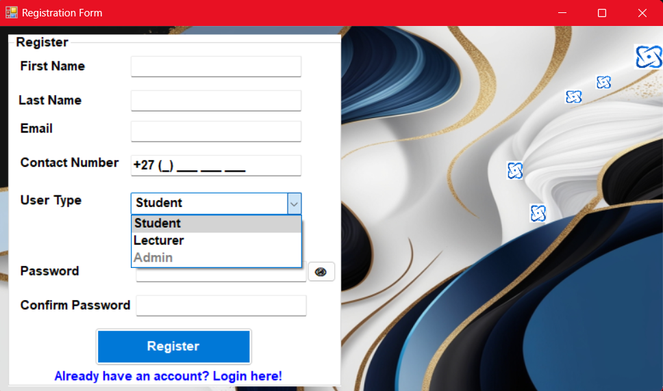
    <p style="text-align: center; font-style: italic; margin-top: 8px;">Registration Screen</p>
  </div>
  <div>
    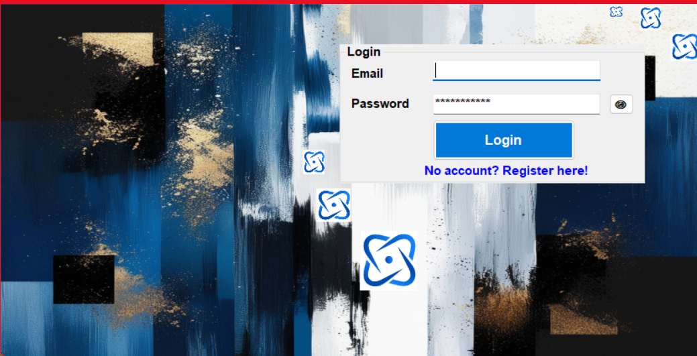
    <p style="text-align: center; font-style: italic; margin-top: 8px;">Login Screen</p>
  </div>
  <div>
    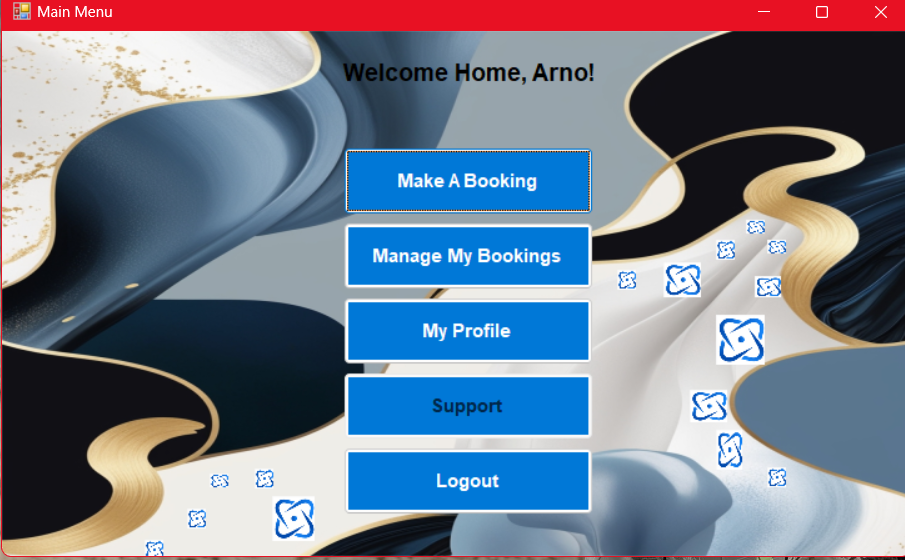
    <p style="text-align: center; font-style: italic; margin-top: 8px;">Admin Profile Home</p>
  </div>
  <div>
    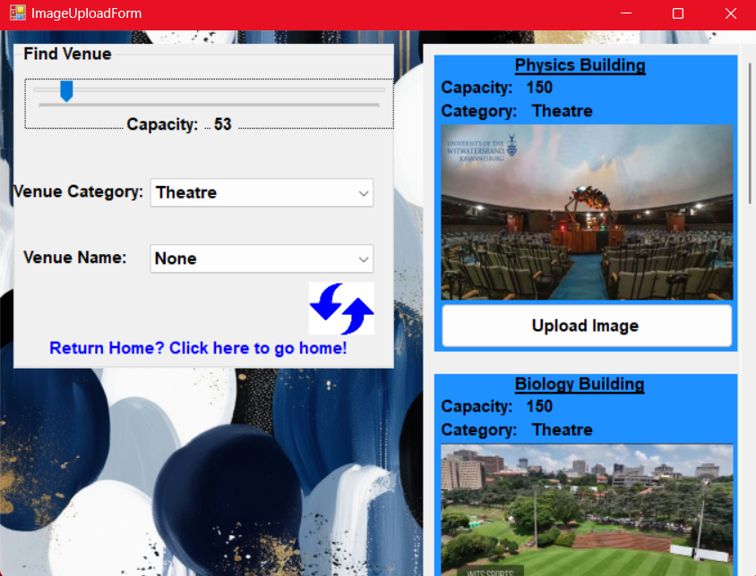
    <p style="text-align: center; font-style: italic; margin-top: 8px;">Find Venue</p>
  </div>
  <div>
    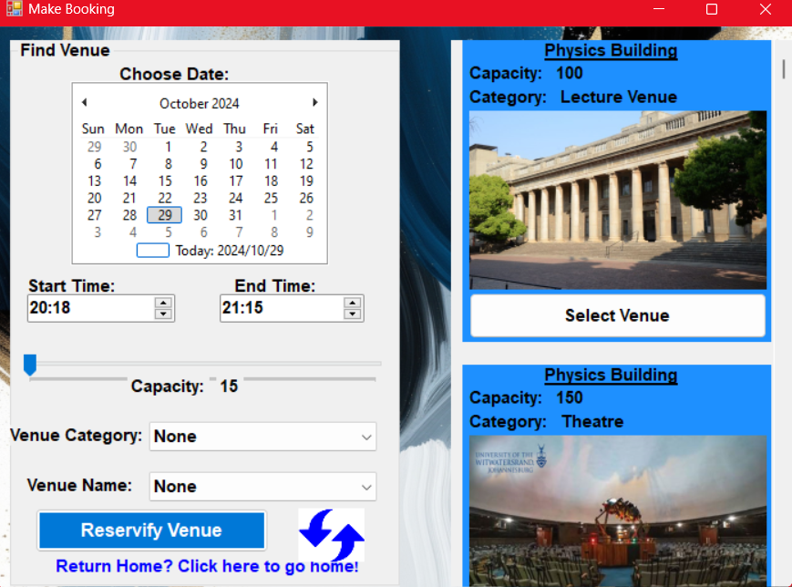
    <p style="text-align: center; font-style: italic; margin-top: 8px;">Reserve Venue With Date</p>
  </div>
  <div>
    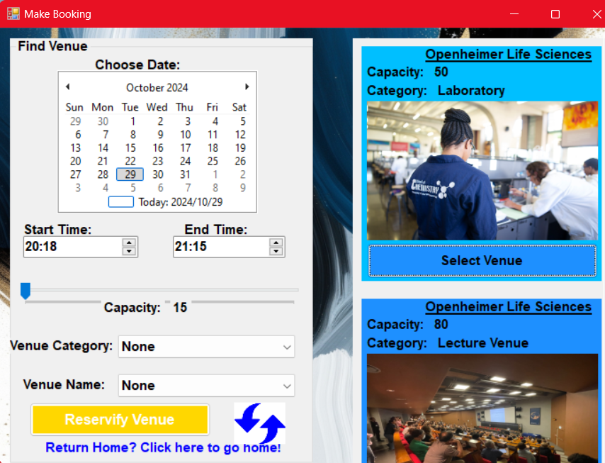
    <p style="text-align: center; font-style: italic; margin-top: 8px;">Confirm Booking</p>
  </div>
  <div>
    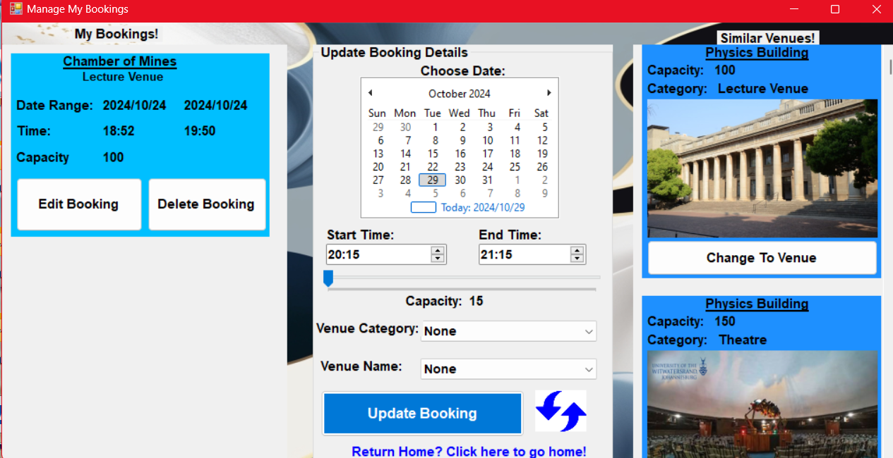
    <p style="text-align: center; font-style: italic; margin-top: 8px;">Manage Bookings</p>
  </div>
  <div>
    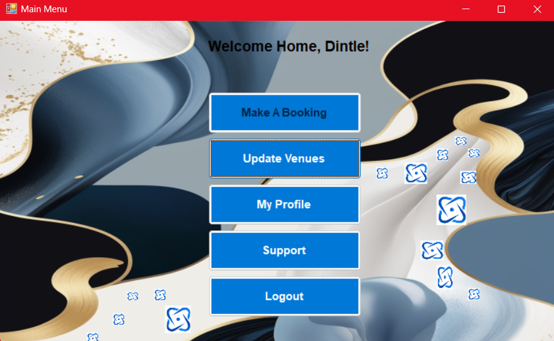
    <p style="text-align: center; font-style: italic; margin-top: 8px;">User Profile</p>
  </div>
  <div>
    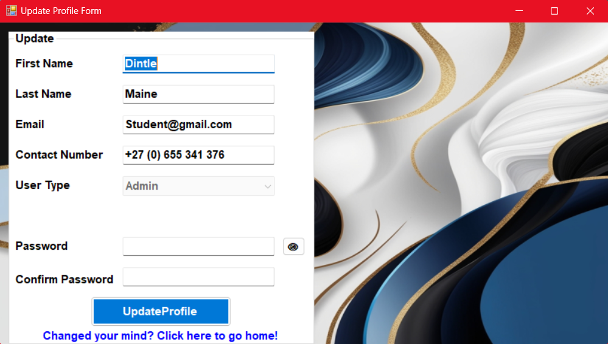
    <p style="text-align: center; font-style: italic; margin-top: 8px;">Update Profile</p>
  </div>
  <div>
    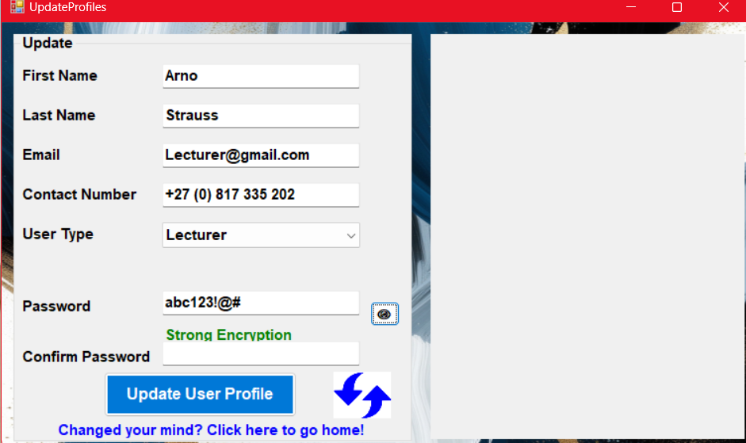
    <p style="text-align: center; font-style: italic; margin-top: 8px;">Profile Encryption</p>
  </div>
  <div>
    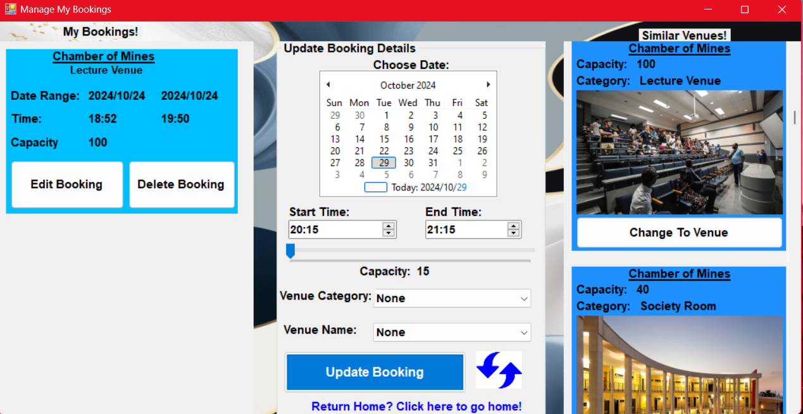
    <p style="text-align: center; font-style: italic; margin-top: 8px;">Swap Venues</p>
  </div>
  <div>
    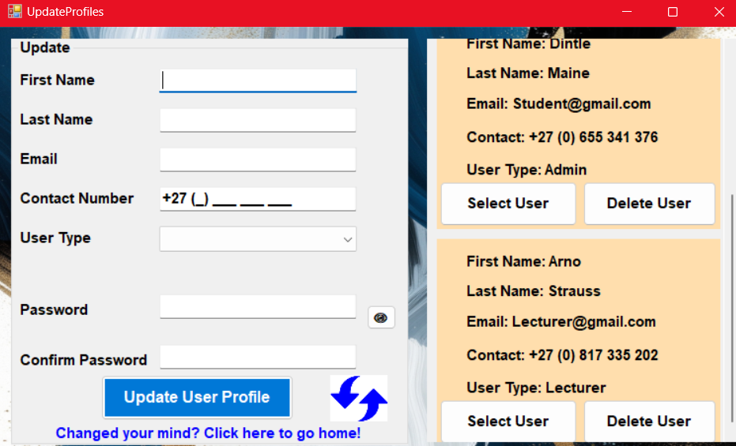
    <p style="text-align: center; font-style: italic; margin-top: 8px;">Admin Delete User</p>
  </div>
  <div>
    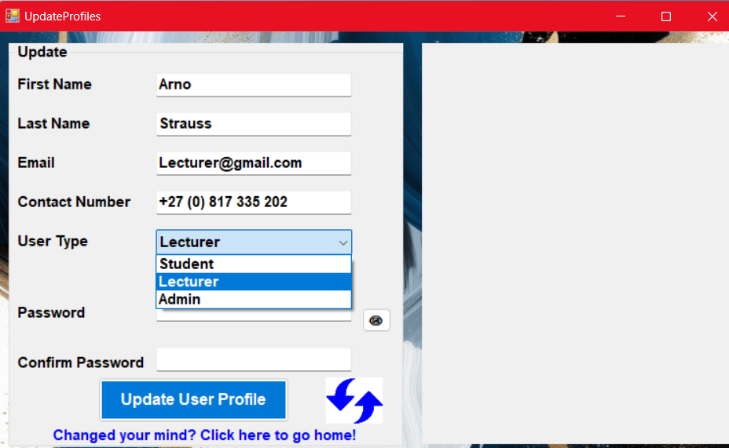
    <p style="text-align: center; font-style: italic; margin-top: 8px;">Admin Update User</p>
  </div>
</div>


---

## 📚 Core Skills Demonstrated

- **Software Development Life Cycle (SDLC)**: This project was developed by following a structured and methodical approach to software development
- **Database Management**: Proficient use of Microsoft Access to design and manage the application's database schema
- **Problem Solving**: Successfully implemented solutions for real-world challenges related to venue booking and resource management
- **C# Development**: Demonstrated strong proficiency in C# for building robust and scalable applications
- **Design Specifications**: Adherence to detailed design documents to ensure the final product meets all requirements

---

## 🚀 How to Get Started

To run this application, you will need to have Microsoft Access and a C# compatible environment installed on your machine.

1. **Clone the repository**:
   ```
   git clone https://github.com/Stralb/Reservify.git
   ```

2. **Open the project**:
   - Open the solution file (.sln) in Visual Studio or a similar C# IDE

3. **Configure the database**:
   - Ensure the connection string in your code points to the included AccessDB file

4. **Run the application**:
   - Build and run the project from your IDE